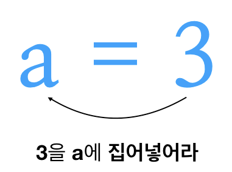
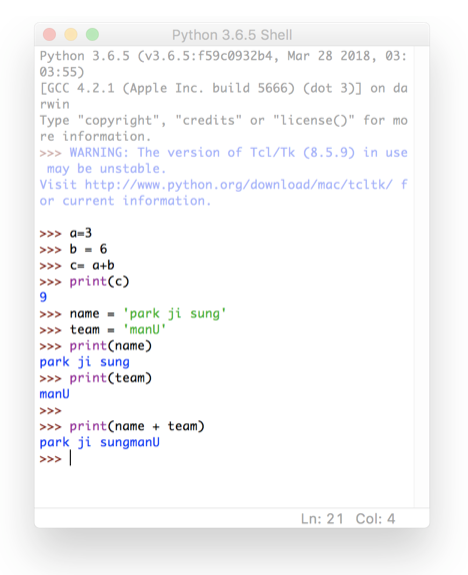
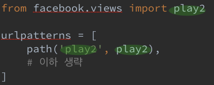
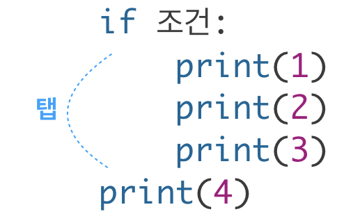

# Stage 1 - 장고로 파이썬 깨닫기 \(1\)

## 앞으로 배울 파이썬 문법

앞으로 딱 네가지의 파이썬 문법만 배우겠습니다. 파이썬의 문법은 이보다 더 많고 알면 알 수록 유용한 것들이 많지만, 저희는 장고를 사용할 수 있는 최소한의 문법만 배웁니다.


### 파이썬 문법을 자세히 알고 싶다면?

보다 자세한 문법을 알고 싶으시다면, "파이썬 기초 문법 스터디"를 추천드립니다.


### 우리가 배울 파이썬 문법

1. 변수
2. if
3. list
4. 함수

## 변수

### 변수란 무엇인가?

변수는 숫자 혹은 문자와 같은 자료들을 잠시 저장해두는 곳입니다.



#### 주의할 점

* **수학의** **=\(같다\)와는** **조금** **달라요**
* **같다라는** **의미는** **python에서** **==으로** **대체합니다.**

### 실습 - 변수 연습

먼저 파이썬을 설치할 때 함께 자동으로 설치된 **IDLE**를 실행합니다.



#### 변수 이름 작성법

변수이름은 영문, 숫자, \_ 를 조합하여 원하는대로 명명하실 수 있습니다.

**예시\)** myName, my\_name, num1, a, b, c, var, …

또한 숫자로 시작하는 변수이름은 사용이 불가능합니다. 변수이름으로 한글도 가능하지만 절대 사용하지 말아주세요.


### 실습 - 페이지 만들기

지난번에 장고를 실행하고 `127.0.0.1:8000/play`로 연결되는 페이지를 만들어봤습니다. 앞으로도 페이지를 만들 일이 많기 때문에 반복적으로 연습할 예정입니다.

처음에는 과정이 복잡해 보일 수 있습니다. 아래 순서에 맞춰 잘 따라와주세요.

#### 1. 무엇을 준비해야하는지 생각해봅시다.

연결될 **페이지 주소**\(url\)과 그 주소에 표시될 **html 파일**이 필요합니다.

**url**: 127.0.0.1:8000/play2  
**html**: templates 폴더에 play2.html을 만들자!

#### 2. play2.html 파일을 templates 폴더안에 생성합니다. templates 폴더를 클릭하고 오른쪽 버튼을 눌러주세요.


#### 3. views.py안에 play2 함수를 추가합니다.

이어서 play2 함수가 play2.html로 연결되도록 만들어줍니다.


#### 4. urls.py를 열고 play2 함수를 play2 주소로 연결합니다.



#### 결과 확인


### 실습 - 변수 in Django

방금 실습에서 만든 play2를 조금 변경해서 변수라는게 장고에서 어떻게 쓰이는지 확인해봅시다.

먼저 views.py를 열어 다음과 같이 수정해주세요.


templates 폴더 안에 있는 play2.html도 수정해주세요.


#### 결과확인


### 실습 - 변수를 이용해 방문자 카운터 만들기

각종 웹사이트의 접속하면 보이는 방문자 카운터의 원리를 알아봅시다.

views.py와 play2.html 파일을 열고 아래와 같이 수정해주세요.



```python
count = 0
def play2(request):
    choidogeun = '최도근'
    global count # 바깥영역의 변수를 사용할 때 global
    count = count + 1 # 접속할 때마다 방문자 1 증가

    return render(request, 'play2.html', { 'name': choidogeun, 'cnt': count })
```





```markup
<!DOCTYPE html>
<html lang="en">
<head> <meta charset="UTF-8">
    <title>Play2</title>
</head>

<body> {{ name }}님 안녕하세요? <br> {{ cnt }} 번째 방문자이십니다!</body>

</html>
```



#### 결과 확인



### global이 뭐죠?

파이썬은 영역의 구분을 tab으로 하고 있습니다. 탭 안 쪽에 있는 영역과 밖에 있는 영역이 다른 셈이죠. 영역이 다르면, 다른 쪽에서 만들어진 변수는 함부로 사용할 수 없습니다. 다만 안쪽 영역에서 밖의 영역에 있는 변수를 사용할 때 global 이라는 키워드를 붙여주면 쉽게 이용가능한 상태가 되는 것이죠.

저희 웹개발 스터디의 경우 앞으로 global을 이용할 일이 없습니다. 여러분들이 파이썬을 따로 배우지 않는 이상 쉽게 볼 수도 없을거예요.


## if

### if란 무엇인가?

제시한 조건이 맞을 때만 범위 안의 구문\(탭안쪽\)을 실행하게 도와주는 문법입니다.



#### 조건이 맞으면?

즉 조건이 참이라면 위의 이미지를 기준으로, 1, 2, 3, 4가 출력됩니다.

#### 조건이 틀리면?

즉 조건이 거짓이라면 4만 출력됩니다.  
1, 2, 3 부분은 실행조차 안됩니다.

### 실습 - if로 나이 체크

나이를 확인하여 미성년자인지 성인인지 판단하는 간단한 파이썬 프로그램을 작성해볼까요?



```python
count = 0
def play2(request):    choidogeun = '최도근'
    age = 20    
    global count # 바깥영역의 변수를 사용할 때 global    
    count = count + 1 # 접속할 때마다 방문자 1 증가    

    if age > 19: # age가 19 보다 크면?
        status = '성인'    
    else: # 성인이 아닌 경우
        status = '청소년'

    return render(request, 'play2.html', { 'name': choidogeun, 'cnt': count, 'age': status })
```





```markup
<!DOCTYPE html>
<html lang="en">
<head>
    <meta charset="UTF-8">
    <title>Play2</title>
</head>

<body> {{ name }}님({{ age }}) 안녕하세요? <br> {{ cnt }} 번째 방문자이십니다!</body>

</html>
```



#### 결과확인


새로고침을 하면 방문 카운트가 변경됩니다.

