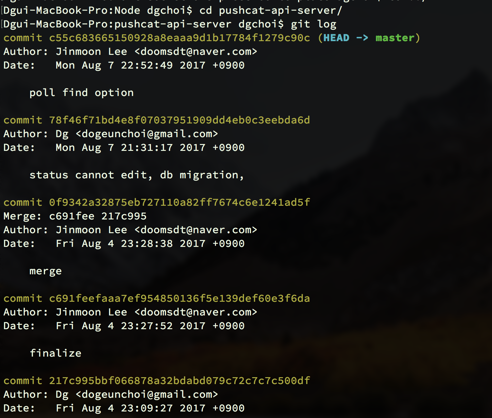
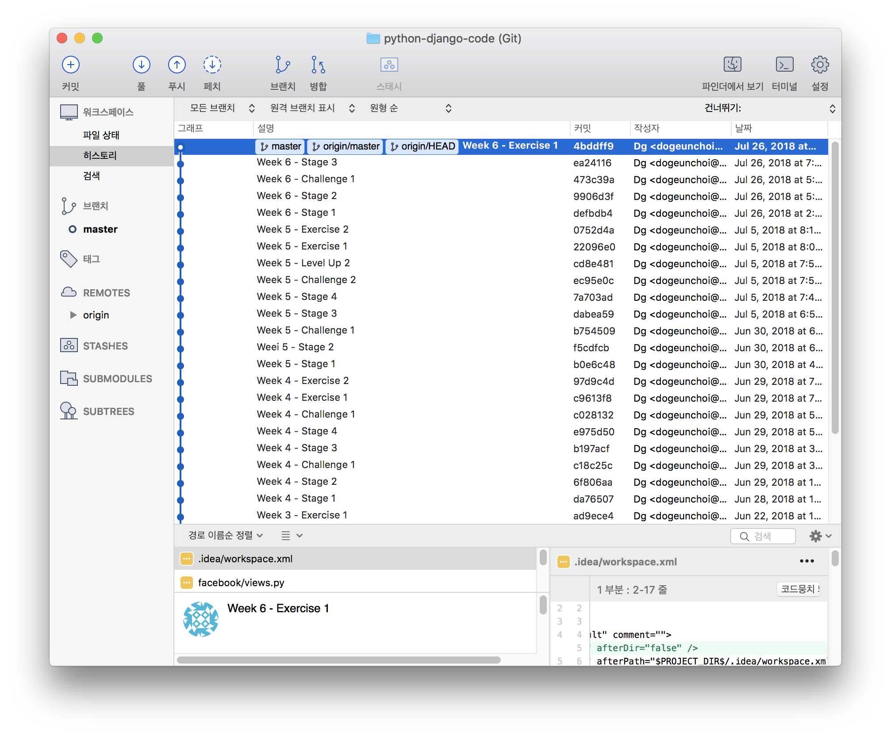

# Level Up 1 - source tree로 git 관리

## 소스트리?

문서, 파일들을 저장하고 관리하기 위해 **구글 드라이브**를 많이 사용합니다. 같은 관점에서 소스코드를 관리하는 방법으로 git을 사용하는데요. 기본적으로 명령프롬포트나 terminal을 열면 나오는 검은 화면창에 하얀 글씨로 명령어를 써가며 작업을 진행합니다. 그러나 이러한 환경에 익숙하지 않은 사용자도 많을 뿐더러 작업상황을 한눈에 파악하기 어렵죠.

소스트리는 git을 사용하기 훨씬 쉽게 만들어줍니다.

보기만해도 편안하죠? 훨씬 쉽게 git을 다룰 수 있다는 자신감이 생깁니다.

## 설치

### 소스트리\(source tree\) 설치

#### 우선 git이 설치되어 있어야 합니다.

아직 설치를 안하셨다면 **Stage3**를 확인해주세요.

#### source tree 다운로드

[https://www.sourcetreeapp.com/](https://www.sourcetreeapp.com/)

## 사용법

소스트리의 사용법을 아주 잘 설명한 자료들을 소개합니다.

|  | 제목 | 주 | 특 |
| :--- | :--- | :--- | :--- |

| 1 | 초심자를 위한 Github 협업 튜토리얼 \(with 토끼와 거북이\) | [https://milooy.wordpress.com/2017/06/21/working-together-with-github-tutorial/](https://milooy.wordpress.com/2017/06/21/working-together-with-github-tutorial/) | 자세한 설명 |
| :--- | :--- | :--- | :--- |

| 2 | Git 설치와 사용법\(SourceTree\) | [http://gbsb.tistory.com/9](http://gbsb.tistory.com/9) | 자세한 설명 |
| :--- | :--- | :--- | :--- |

<table>
  <thead>
    <tr>
      <th style="text-align:left">3</th>
      <th style="text-align:left">
        <ol>
          <li>&#xAE43;&amp;&#xC18C;&#xC2A4;&#xD2B8;&#xB9AC; &#xC0AC;&#xC6A9;&#xBC95;</li>
        </ol>
      </th>
      <th style="text-align:left"><a href="http://jy-doromi.tistory.com/34">http://jy-doromi.tistory.com/34</a>
      </th>
      <th style="text-align:left">&#xAC04;&#xB2E8;&#xD55C; &#xC124;&#xBA85;</th>
    </tr>
  </thead>
  <tbody></tbody>
</table>