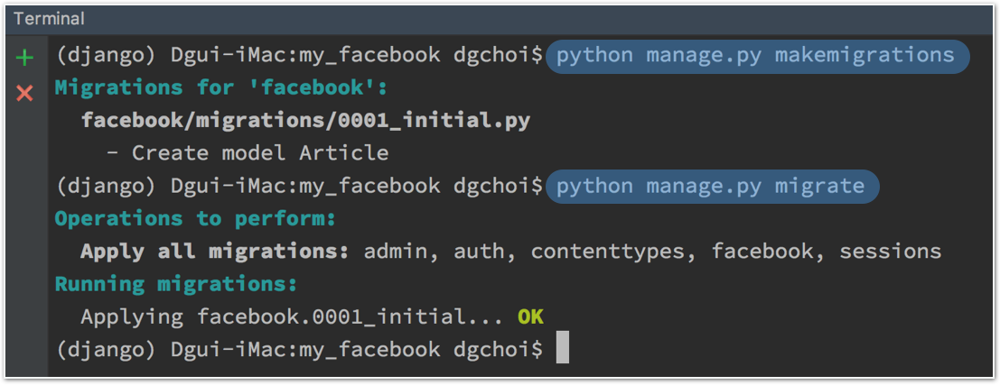
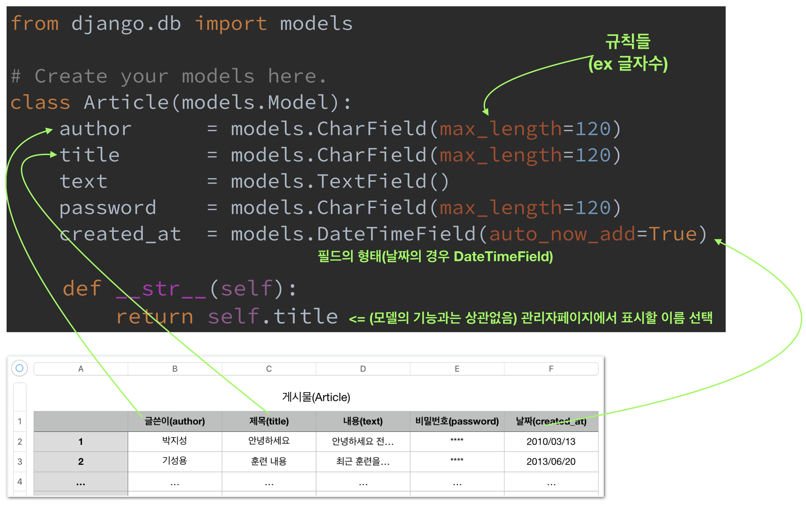

# Stage 2 - 게시글 모델링

## 모델링

### 목적

보존하고 싶은 데이터를 체계적으로 정리하여 언제든 찾아볼 수 있도록 영구히 저장

### 설명

말로만 듣던 데이터베이스란 것을 직접 만든다고 생각하시면 됩니다.


엑셀은 데이터베이스의 좋은 예입니다. 사용하기도 쉬어 우리가 많은 자료를 관리하는데 도움을 주죠. 그치만 웹사이트와 연결하기 어렵고 보안이 좋지 않아 서비스로 만들기에는 무리가 있습니다. 그래서 데이터베이스를 구축해야합니다.

#### 만약 데이터베이스의 내용들이 장고와 연결이 된다면?

👉🏻 게시판을 만들 수 있게 된다.  
👉🏻 회원시스템을 만들 수 있게 된다.

## 실습

### 1. facebook/models.py 파일을 열어서 아래의 내용으로 채웁니다.  <a id="practice-1"></a>



```python
from django.db import models

# Create your models here.
class Article(models.Model):
    author      = models.CharField(max_length=120)
    title       = models.CharField(max_length=120)
    text        = models.TextField()
    password    = models.CharField(max_length=120)
    created_at  = models.DateTimeField(auto_now_add=True)

    def __str__(self):
        return self.title
```



### 2. 터미널에서 python manage.py makemigrations 실행, 이어서 python manage.py migrate 실행합니다.

모델 관련 작업을 한 후에는 장고에게 변화를 알려주기 위해, 반드시 위 2개의 명령문을 실행해주어야 합니다. 모델을 추가/수정/삭제하는 모든 경우에 해당됩니다.



## 이해하기

**models.py**는 데이터베이스\(즉 모델\)에 대한 설명서 역할을 합니다.



| **field** **종류** | **용도** |
| :--- | :--- |
| CharField | 짧은 텍스트\(e.g 글 제목\) |
| TextField | 긴 텍스트\(e.g 글 내용\) |
| DateTimeField | 날짜 |
| ForeignKey | 다른 모델과의 관계 설명  \(ex 코멘트는 게시글에 포함된다.\) **\* 6주차에** **실습합니다.** |

